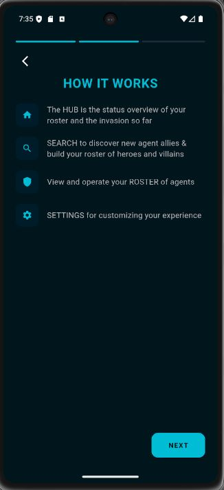
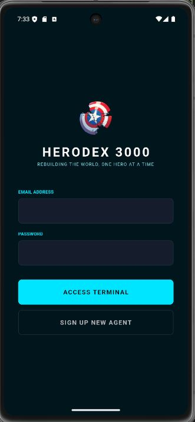
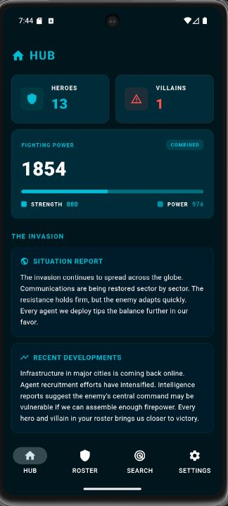
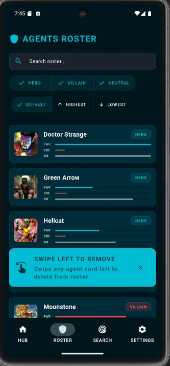
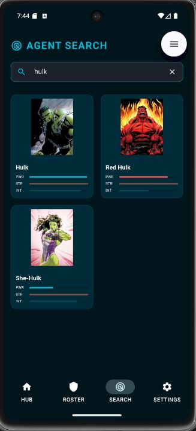
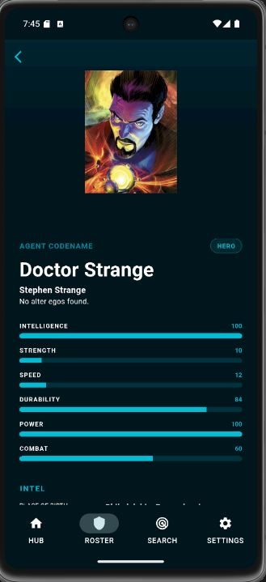
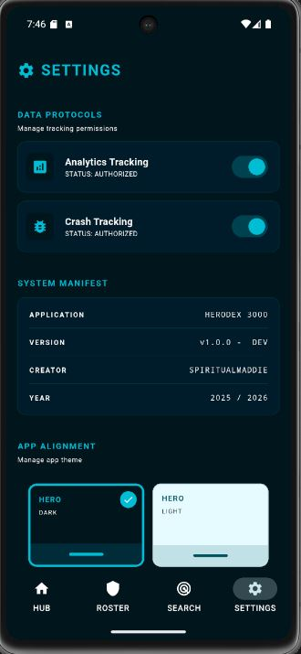

# 🦸‍♂️ HeroDex 3000

[](https://flutter.dev)
[](https://firebase.google.com)
[](LICENSE)
[]()

> **"The world fell. We rebuilt it, one hero at a time."**

HeroDex 3000 is a mission-critical hero and villain roster management system developed for humanity's fight against the invasion. Built with Flutter and Firebase, it provides a stable, cross-platform interface for tracking and managing superhuman operatives in a post-invasion world.

**Developed by:** [SpiritualMaddie](https://github.com/SpiritualMaddie)  
**Course:** Dart & Flutter (HFL25-2)  
**Period:** September 2025 - February 2026  
**Version:** 1.0.0

---

## 📖 Table of Contents

- [The Story](#-the-story)
- [Features](#-features)
- [Screenshots](#-screenshots)
- [Tech Stack](#-tech-stack)
- [Architecture](#-architecture)
- [Installation](#-installation)
- [Platform Support](#-platform-support)
- [Testing](#-testing)
- [Accessibility](#-accessibility)
- [Known Limitations](#-known-limitations)
- [Future Improvements](#-future-improvements)
- [License](#-license)

---

## 🌍 The Story

**The world after the invasion.**

An unknown invasion struck without warning. Internet. Devices. Communication. Society collapsed.

But in the chaos, the brilliant minds of HFL25-2 created the HeroDex Terminal — a simple but powerful application that enabled heroes and villains to collaborate. Together, they managed to slow the invasion.

Now the world is back online. Devices have awakened. But the fight isn't over.

To stop the invasion completely, humanity needs a new HeroDex — modern, stable, and accessible to all.

**That's where HeroDex 3000 comes in.**

---

## ✨ Features

### 🔐 Authentication & Onboarding
- **Firebase Authentication** - Secure email/password login and registration
- **Interactive Onboarding** - 3-page guided tour explaining the mission
- **Permission Management** - User-controlled Analytics, Crashlytics, and iOS ATT (App Tracking Transparency)
- **First-time Setup** - Guides new operatives through essential configuration

### 🔍 Agent Search
- **Real-time API Search** - Query the SuperHero API for heroes and villains
- **Debounced Search** - 1200ms delay prevents excessive API calls
- **Beautiful Grid Layout** - Responsive card-based results
- **Shimmer Loading** - Professional loading states while fetching data
- **Detailed Agent Views** - Full stats, biography, appearance, work, and connections

### 🛡️ Roster Management
- **Firebase Firestore Storage** - Cloud-synced personal roster
- **Advanced Filtering** - Filter by alignment (Hero/Villain/Neutral)
- **Power Sorting** - Sort agents by power level (Highest/Lowest/Default)
- **Search Within Roster** - Quick local search through saved agents
- **Swipe to Delete** - Intuitive gesture-based removal
- **Pull to Refresh** - Manual sync with Firestore
- **Optimistic Updates** - Instant UI feedback with automatic rollback on errors

### 🏠 Mission Control (Hub)
- **Real-time Statistics** - Hero count, Villain count, total fighting power
- **War Updates** - Dynamic situation reports based on roster composition
- **Recent Developments** - Intelligence briefings that adapt to agent alignment
- **Contribution Tracker** - Shows your impact on the resistance effort

### 🎨 Theming System
- **6 Custom Themes** - Hero/Villain/Neutral alignments × Dark/Light modes
- **Alignment-based Colors** - Cyan for heroes, red for villains, purple for neutrals
- **Persistent Preferences** - Theme choice saved locally
- **Dynamic UI** - All screens adapt to selected theme

### ⚙️ Settings & Configuration
- **Theme Picker** - Visual grid for selecting app appearance
- **Analytics Toggle** - Real-time Firebase Analytics control
- **Crashlytics Toggle** - Opt-in error reporting (Android/iOS only)
- **App Information** - Version, creator, and project details
- **Secure Logout** - Clean session termination with state reset

### 🌐 Cross-Platform Design
- **Responsive Layouts** - Adapts to mobile, tablet, and desktop screens
- **Breakpoint System** - Mobile (<600px), Tablet (600-1200px), Desktop (>1200px)
- **Platform-Aware UI** - Optimized components for each target platform
- **Web CORS Handling** - Automatic proxy fallback for browser restrictions

---

## 📱 Screenshots

### Onboarding & Authentication
<p align="center">
  
  &nbsp; &nbsp; &nbsp;
  
</p>
<p align="center">
  <em>Left: First-time user experience with permission selection and theme picker</em><br/>
  <em>Right: Secure authentication portal</em>
</p>

### Core Functionality
<p align="center">
  
  &nbsp; &nbsp; &nbsp;
  
  &nbsp; &nbsp; &nbsp;
  
  
</p>
<p align="center">
  <em>War statistics • Real-time search • Agent roster with filters</em>
</p>

<p align="center">
  
  &nbsp; &nbsp; &nbsp;
  
</p>
<p align="center">
  <em>Left: Comprehensive agent information • Right: App settings and configuration</em>
</p>

---

## 🛠 Tech Stack

### Framework & Language
- **Flutter 3.10.7** - Cross-platform UI framework
- **Dart SDK 3.10.7** - Primary programming language

### Firebase Services
- **Firebase Core** - Foundation for all Firebase services
- **Firebase Auth** - User authentication and session management
- **Firebase Analytics** - User behavior tracking (opt-in)
- **Firebase Crashlytics** - Error monitoring and crash reporting (opt-in, Android/iOS only)
- **Cloud Firestore** - Real-time NoSQL database for roster storage

### State Management & Navigation
- **flutter_bloc** - BLoC/Cubit pattern for predictable state management
- **go_router** - Declarative routing with deep linking support
- **provider** - Dependency injection and state broadcasting

### UI & UX
- **shimmer** - Loading skeleton animations
- **cupertino_icons** - iOS-style icons
- **Custom responsive system** - Breakpoint-based layout adaptation

### Platform Integration
- **app_tracking_transparency** - iOS 14+ ATT compliance
- **package_info_plus** - Version and build information
- **shared_preferences** - Local key-value storage

### Networking & APIs
- **http** - HTTP client for REST API calls
- **flutter_dotenv** - Environment variable management
- **SuperHero API** - External API for hero/villain data

### Development Tools
- **flutter_launcher_icons** - Multi-platform app icon generation
- **flutter_native_splash** - Native splash screen creation
- **flutter_lints** - Dart code quality rules
- **flutter_test** - Unit and widget testing framework

---

## 🏗 Architecture

HeroDex 3000 follows **Clean Architecture** principles with clear separation of concerns:

```
├── 📁 barrel_files
│   ├── 📄 authentication.dart
│   ├── 📄 dart_flutter_packages.dart
│   ├── 📄 factories.dart
│   ├── 📄 firebase.dart
│   ├── 📄 interfaces.dart
│   ├── 📄 managers.dart
│   ├── 📄 models.dart
│   ├── 📄 repositories.dart
│   ├── 📄 routing.dart
│   ├── 📄 screens.dart
│   ├── 📄 services.dart
│   ├── 📄 theme.dart
│   ├── 📄 utils.dart
│   └── 📄 widgets.dart
├── 📁 core
│   ├── 📁 errors
│   ├── 📁 navigation
│   │   └── 📁 routing
│   │       ├── 📄 app_router.dart
│   │       └── 📄 root_navigation.dart
│   ├── 📁 providers
│   │   └── 📄 app_providers.dart
│   ├── 📁 theme
│   │   ├── 📁 cubit
│   │   │   └── 📄 theme_cubit.dart
│   │   └── 📄 app_theme.dart
│   └── 📁 utils
│       └── 📄 responsive.dart
├── 📁 data
│   ├── 📁 factories
│   │   └── 📄 http_client_factory.dart
│   ├── 📁 managers
│   │   ├── 📄 agent_cache.dart
│   │   ├── 📄 agent_data_manager.dart
│   │   ├── 📄 settings_manager.dart
│   │   └── 📄 splash_manager.dart
│   ├── 📁 models
│   │   ├── 📄 agent_model.dart
│   │   ├── 📄 appearance_model.dart
│   │   ├── 📄 biography_model.dart
│   │   ├── 📄 connections_model.dart
│   │   ├── 📄 image_model.dart
│   │   ├── 📄 powerstats_model.dart
│   │   └── 📄 work_model.dart
│   ├── 📁 repositories
│   │   ├── 📁 interfaces
│   │   │   ├── 📄 iagent_data_manager.dart
│   │   │   ├── 📄 ihttp_client_factory.dart
│   │   │   └── 📄 isuper_hero_api_repository.dart
│   │   ├── 📄 firestore_repository.dart
│   │   └── 📄 super_hero_api_repository.dart
│   └── 📁 services
│       ├── 📄 firebase_service.dart
│       └── 📄 shared_preferences_service.dart
├── 📁 features
│   ├── 📁 authentication
│   │   ├── 📁 controllers
│   │   │   ├── 📁 cubit
│   │   │   │   ├── 📄 auth_cubit.dart
│   │   │   │   └── 📄 auth_state.dart
│   │   │   └── 📁 repository
│   │   │       └── 📄 auth_repository.dart
│   │   └── 📁 screens
│   │       └── 📄 login_screen.dart
│   ├── 📁 home
│   │   └── 📁 screens
│   │       └── 📄 home_screen.dart
│   ├── 📁 onboarding
│   │   └── 📁 screens
│   │       └── 📄 onboarding_screen.dart
│   ├── 📁 roster
│   │   └── 📁 screens
│   │       └── 📄 roster_screen.dart
│   ├── 📁 search
│   │   └── 📁 screens
│   │       └── 📄 search_screen.dart
│   └── 📁 settings
│       └── 📁 screens
│           └── 📄 settings_screen.dart
├── 📁 presentation
│   ├── 📁 helpers
│   │   └── 📄 agent_summary_mapper.dart
│   ├── 📁 screens
│   │   ├── 📄 agent_details_screen.dart
│   │   ├── 📄 error_screen.dart
│   │   └── 📄 splash_screen.dart
│   ├── 📁 view_models
│   │   └── 📄 agent_summary.dart
│   └── 📁 widgets
│       ├── 📄 agent_card.dart
│       ├── 📄 cors_proxy_image.dart
│       ├── 📄 app_snackbar.dart
│       ├── 📄 info_card.dart
│       ├── 📄 responsive_scaffold.dart
│       ├── 📄 screen_header.dart
│       ├── 📄 section_header.dart
│       └── 📄 theme_picker.dart
├── 📁 utils
├── 📄 firebase_options.dart
└── 📄 main.dart
```

---
*Generated by FileTree Pro Extension*

### Key Design Patterns

**Repository Pattern**
- `SuperHeroApiRepository` - Abstracts API calls with CORS proxy fallback
- `FirestoreRepository` - Handles all Firestore CRUD operations
- `AuthRepository` - Manages Firebase Authentication

**Singleton Pattern**
- `AgentDataManager` - Centralized data access coordinator
- `SharedPreferencesService` - Handles device specific preferences

**View Model Pattern**
- `AgentSummary` - Lightweight model for list/card displays
- `AgentSummaryMapper` - Transforms full models to summaries

**State Management**
- `AuthCubit` - Authentication state (logged out/loading/authenticated)
- `ThemeCubit` - Theme selection and persistence

---

## 📦 Installation

### Prerequisites

- **Flutter SDK 3.10.7 or higher** - [Install Flutter](https://flutter.dev/docs/get-started/install)
- **Dart SDK 3.10.7 or higher** (bundled with Flutter)
- **Firebase Project** - [Create Firebase project](https://console.firebase.google.com/)
- **SuperHero API Key** - [Get API key](https://www.superheroapi.com/)

### Setup Steps

1. **Clone the repository**
   ```bash
   git clone https://github.com/SpiritualMaddie/flutter_herodex3000.git
   cd flutter_herodex3000
   ```

2. **Install dependencies**
   ```bash
   flutter pub get
   ```

3. **Configure environment variables**
   
   Create a `.env` file in the project root:
   ```env
   API_URL=https://superheroapi.com/api
   API_URL_WITH_KEY=https://superheroapi.com/api/YOUR_API_KEY_HERE
   ```
   
   Replace `YOUR_API_KEY_HERE` with your actual SuperHero API key.

4. **Set up Firebase**
   
   a. Create a new Firebase project at [Firebase Console](https://console.firebase.google.com/)
   
   b. Enable the following services:
      - Authentication (Email/Password)
      - Cloud Firestore
      - Analytics (optional)
      - Crashlytics (optional)
   
   c. Add your apps (Android, iOS, Web) and download configuration files:
      - Android: `google-services.json` → `android/app/`
      - iOS: `GoogleService-Info.plist` → `ios/Runner/`
      - Web: Configure via `firebase_options.dart`
   
   d. Run Firebase configuration:
      ```bash
      flutterfire configure
      ```

5. **Generate app icons and splash screens**
   ```bash
   dart run flutter_launcher_icons
   dart run flutter_native_splash:create
   ```

6. **Run the app**
   ```bash
   # Android
   flutter run -d android
   
   # iOS
   flutter run -d ios
   
   # Web
   flutter run -d chrome
   
   # Windows
   flutter run -d windows
   ```

### Troubleshooting

**Build errors?**
```bash
flutter clean
flutter pub get
flutter pub upgrade
```

**Firebase connection issues?**
- Verify `google-services.json` and `GoogleService-Info.plist` are in correct locations
- Re-run `flutterfire configure`
- Check Firebase project authentication is enabled

**API not working?**
- Verify `.env` file exists in project root
- Check API key is valid at [SuperHeroAPI.com](https://www.superheroapi.com/)
- Ensure `.env` is listed in `pubspec.yaml` assets

---

## 🌐 Platform Support

### ✅ Fully Supported
- **Android** (Primary target, extensively tested)
  - All features working
  - Direct image loading (no CORS issues)
  - Crashlytics enabled
  - Native splash screen

### ⚠️ Partially Supported
- **Web** (Chrome, Edge, Firefox)
  - Search and navigation fully functional
  - ~20% of images load successfully (CORS limitations from SuperHeroDB CDN)
  - Graceful fallback to shield placeholders for blocked images
  - Crashlytics disabled (not supported on web)
  - *Tip: Scroll through roster/search a few times if images don't load initially*

- **Windows** (Desktop)
  - Core functionality works
  - Limited testing performed
  - Recommended for development/testing only

### 🔄 Expected to Work (Untested)
- **iOS** (iPhone/iPad)
  - App Tracking Transparency (ATT) implemented
  - Crashlytics enabled
  - All features should work
  - *Not tested due to lack of Mac/iOS simulator*

- **macOS** (Desktop)
  - Firebase services configured
  - Responsive layouts implemented
  - *Not tested due to lack of Mac/iOS simulator*

- **Linux** (Desktop)
  - Flutter support available
  - *Not tested*

### Platform-Specific Notes

**Web Limitations**
- **Image Loading**: SuperHeroDB.com blocks CORS proxy requests for some images. This is a CDN limitation, not an app bug. On mobile platforms, all images load perfectly without proxies.
- **CORS Proxy Fallback**: The app tries multiple proxies (`corsproxy.io`, `allorigins.win`, direct) before showing placeholder.
- **Performance**: Slower than native due to proxy overhead.

**Mobile Optimizations**
- Direct API and image requests (no proxy needed)
- Crashlytics error reporting
- Native splash screens

---

## 🧪 Testing

### Unit Tests

HeroDex 3000 includes comprehensive unit tests covering critical data flows:

```bash
# Run all tests
flutter test

# Run with coverage
flutter test --coverage
```

### Test Coverage

**Test Files:**
- `test/agent_model_test.dart` - AgentModel JSON parsing and serialization
- `test/agent_summary_mapper_test.dart` - View model mapping logic
- `test/biography_model_test.dart` - Empty data handling
- `test/powerstats_model_test.dart` - Safe parsing of nullable stats
- `test/appearance_model_test.dart` - Malformed data handling

**What's Tested:**
- ✅ JSON deserialization from SuperHero API
- ✅ Null safety (handles "null" strings, empty strings, actual nulls)
- ✅ AgentModel → AgentSummary mapping
- ✅ Alignment detection (hero/villain/neutral)
- ✅ PowerStats safe parsing
- ✅ Edge cases (long names, empty arrays, malformed data)


## ♿ Accessibility

### Implemented Features

**Swipe-to-Delete Discovery Tooltip**
- First-time hint overlay on Roster screen
- Auto-dismisses after 25 seconds - time to read
- Manual dismissal via tap or close button
- High contrast
- Persistent setting (never shows again after dismissal)
- Shows only when roster has agents

**Visual Accessibility**
- High contrast theme options (Hero/Villain/Neutral) - tested via [WEBAIM - Contrast Checker](https://webaim.org/resources/contrastchecker/)
- Large, clear typography throughout
- Icon + text labels on buttons
- Color-coded alignments (cyan/red/purple)

**Interaction Accessibility**
- Swipe gestures with visual feedback
- Error states with clear messaging

### Planned Improvements (Future Versions)

**Delete Button on Detail Screen**
- Current limitation: Swipe-to-delete is the only removal method
- Accessibility concern: Not all users can perform swipe gestures
- Planned: Add explicit "Remove from Roster" button on AgentDetailsScreen
- Note: Ran out of time before deadline, marked as high-priority improvement

**Neutral Agent Theming**
- Current limitation: Neutral agents use villain styling
- Planned: Purple accent colors for neutral alignment
- Planned: Include neutral agents in Home screen statistics

---

## ⚠️ Known Limitations

### Web Platform
**Image Loading Issues**
- **Problem**: SuperHeroDB.com CDN blocks CORS proxy requests
- **Impact**: ~40% of images fail to load on web
- **Workaround**: Scroll through lists multiple times; some images load on retry
- **Fallback**: Shield placeholder icons for blocked images
- **Note**: This is a third-party CDN limitation, not an app bug. All images work on mobile.

**CORS Proxy Reliability**
- Multiple proxies attempted in order: `corsproxy.io` → `allorigins.win` → direct
- Proxy services can be slow or temporarily unavailable
- Recommendation: Use mobile app for best experience

### Missing Features (Ran Out of Time)

**Neutral Agent Integration**
- Neutral agents saved to roster but not highlighted with distinct colors
- Not included in Home screen statistics breakdown
- Planned for v1.1.0

**Delete Button on Detail Screen**
- Current: Swipe-to-delete only (accessibility concern)
- Planned: Explicit "Remove from Roster" button on AgentDetailsScreen
- Priority: High (accessibility improvement)

### Untested Platforms
- iOS: ATT implemented but not tested (no Mac/iOS simulator)
- macOS: Firebase configured but not tested
- Linux: Expected to work but not validated

### Firebase Setup Required
- Users must create their own Firebase project
- Cannot use developer's Firebase instance (security rules)
- Requires manual configuration of Auth, Firestore, Analytics, Crashlytics  

---

## 🚀 Future Improvements

### v1.1.0 (Planned)
- [ ] Explicit delete button on AgentDetailsScreen (accessibility)
- [ ] Neutral agent theming with purple accents
- [ ] Include neutral agents in Home screen statistics
- [ ] Better SOC and things like shared SnackBars

### v1.2.0 (Wishlist)
- [ ] Search history with suggestions
- [ ] Offline mode with cached data

### v2.0.0 (Major)
- [ ] Location-based features (agent battle map)
- [ ] Weather integration for mission planning
- [ ] Network error toaster notifications
- [ ] Animated statistics dashboard
- [ ] Push notifications for war updates

---

## 📄 License

This project is licensed under the MIT License - see the [LICENSE](LICENSE) file for details.

---

## 🙏 Acknowledgments

- **HFL25-2 Course** - Dart & Flutter instruction (Sep 2025 - Feb 2026)
- **SuperHero API** - Hero and villain data source
- **Firebase** - Backend infrastructure
- **Flutter Community** - Packages and support
- **Claude AI** - README and coding support

---

## About me

**Developer:** SpiritualMaddie  
**GitHub:** [@SpiritualMaddie](https://github.com/SpiritualMaddie)  
**Project Repository:** [flutter_herodex3000](https://github.com/SpiritualMaddie/flutter_herodex3000)

---

<div align="center">

**"The world fell. We rebuilt it, one hero at a time."**

🦸‍♀️ *HeroDex 3000 - Built for humanity's resistance* 🦸‍♂️

</div>
